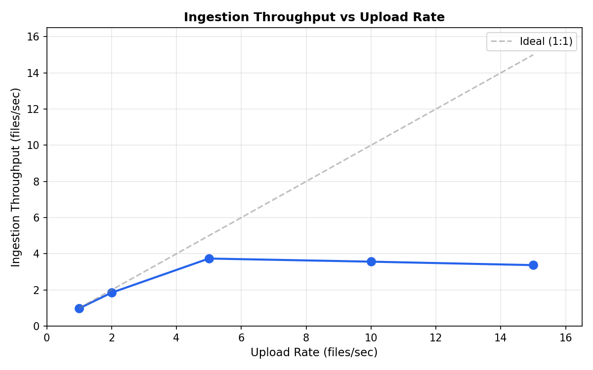
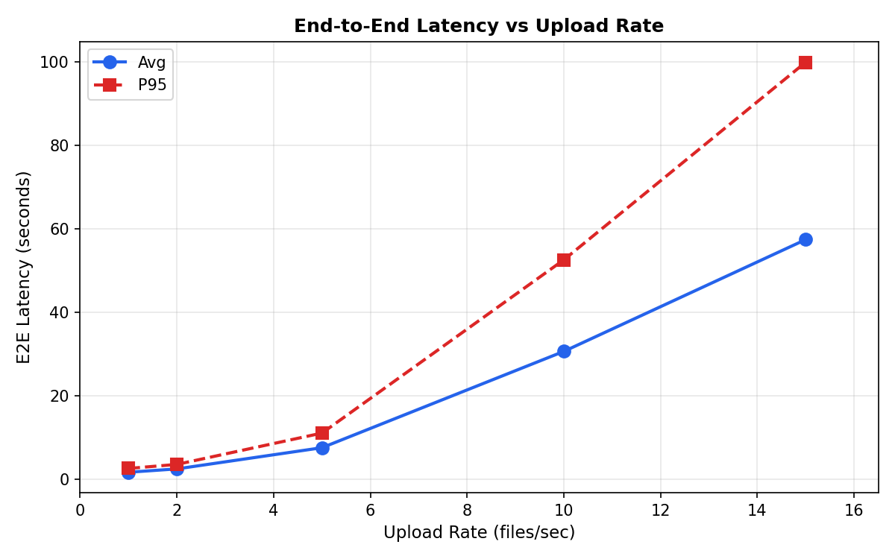
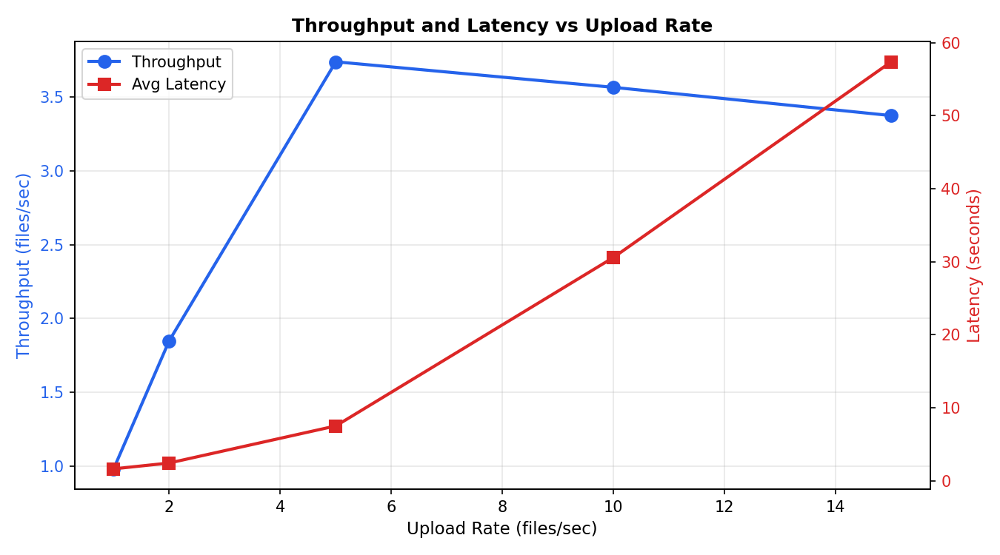

# Document Ingestion Scalability Results

Date: 2026-01-19 01:31

## Configuration

- Rates tested: [1.0, 2.0, 5.0, 10.0, 15.0]
- Duration per rate: 30.0s
- Test files: 50

## Results

| Rate | Throughput | Uploaded | Indexed | Avg E2E | P95 E2E | Chunks |
|------|------------|----------|---------|---------|---------|--------|
| 1.0 | 0.98 | 31 | 31 | 1.63s | 2.53s | 93 |
| 2.0 | 1.85 | 60 | 60 | 2.43s | 3.50s | 180 |
| 5.0 | 3.74 | 150 | 150 | 7.51s | 11.01s | 450 |
| 10.0 | 3.56 | 300 | 300 | 30.59s | 52.53s | 900 |
| 15.0 | 3.37 | 449 | 449 | 57.38s | 99.89s | 1347 |

## Figures

## Metrics

- **Throughput**: Files fully indexed per second
- **E2E Latency**: Time from upload start to vector stored in Qdrant
